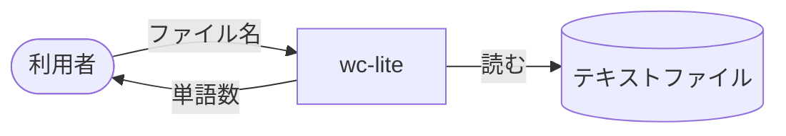
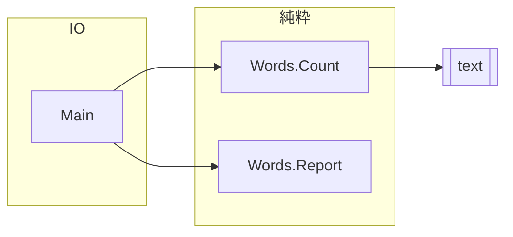
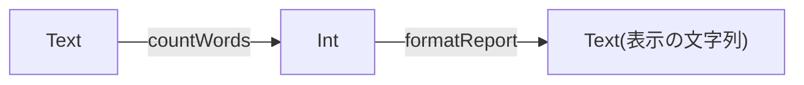
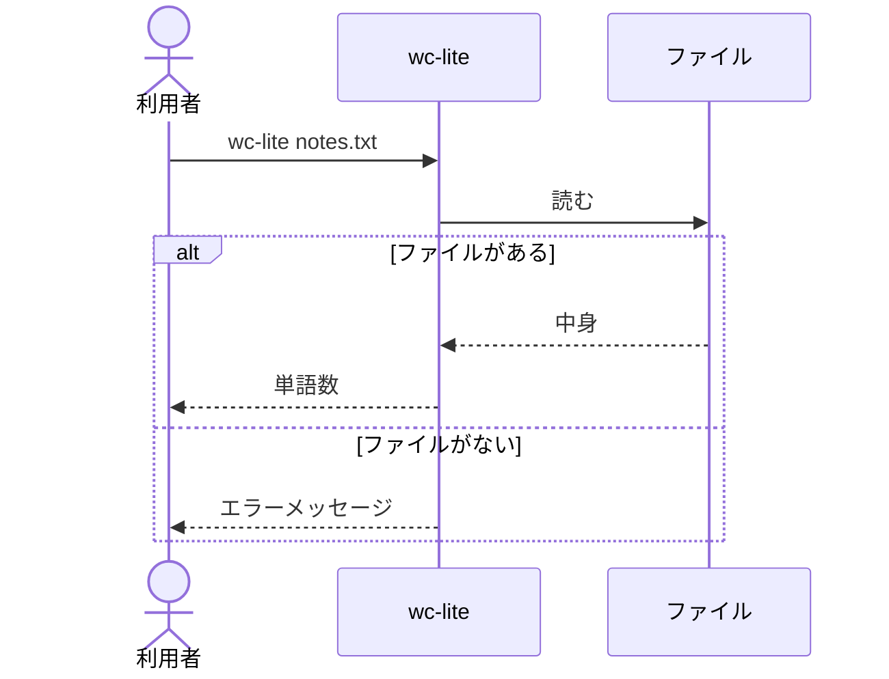

# 設計文書の書き方

各Iterationでは，テストリストを書いたあとに設計文書を更新し，実装のあとで設計文書と実装を見比べる．
テストリストは「何をするか」(振る舞い)を，設計文書は「どう組み立てるか」(構造)を表す．

## 進め方

1. テストリストで，このIterationで増える振る舞いを決める．
2. 設計文書に，その振る舞いを実現するモジュール，型，関数，メッセージを書き足す．
3. テストファーストで実装する．実装の途中で設計を変えたくなったら，変えてよい．
4. 設計文書と実装を見比べ，違うところは設計文書を直す．設計文書は，いつも今のプログラムの姿を表す．

## 4つの設計文書

各パッケージの`design/`に置く．
C4モデルの考え方で，サーバを3つの拡大率(Context，Component，Code)で描き，加えてLSPのメッセージの順序を描く．

| ファイル | 表すもの |
| --- | --- |
| `c4-context.md` | プログラムの外側．利用者，エディタ，サーバ，ファイルと，その間でやり取りするもの |
| `c4-component.md` | サーバの中のモジュールと，importの向き |
| `code-flow.md` | 型をノード，関数を矢印のラベルにした，入力から出力までのデータの流れ |
| `lsp-sequence.md` | エディタとサーバが交わすメッセージの順序 |

図はMarkdownの中にMermaidで書く．
以下の例は，このコースの題材とは別の小さなプログラム`wc-lite`(ファイルの単語数を数えるコマンド)で書いてある．

### c4-context.md

利用者，プログラム，プログラムが読み書きするものを箱で描き，矢印のラベルにやり取りするものを書く．

````markdown
`wc-lite`は，利用者が指定したテキストファイルを読み，単語数を表示する．


````

### c4-component.md

モジュールを箱で描き，`A --> B`で「AがBをimportする」を表す．
ノードのIDは`Words_Count`のように英数字と`_`で書き，ラベル`["Words.Count"]`にモジュール名をそのまま書く．
純粋な関数だけのモジュールと，IOを扱うモジュールを`subgraph`で分ける．
パッケージの外のライブラリは，IDを`ext_`で始める．
矢印は1行に1本書く．

````markdown
`Main`がファイルを読み，純粋な`Words.Count`で数え，`Words.Report`で表示の文字列にする．


````

`mise run lint:design`が，この図の矢印とソースのimportを比べ，片方にしかない依存を報告する．

### code-flow.md

型をノードに，関数を矢印のラベルに書く．
失敗しうる関数は`Either`の分岐として描く．

````markdown
ファイルの中身から単語数を数え，表示の文字列を作る．



- `countWords`は，連続した空白を1つの区切りとみなす．
````

### lsp-sequence.md

参加者とメッセージを時間の順に描く．
応答は点線の矢印(`-->>`)，条件による分岐は`alt`で描く．

````markdown
利用者がコマンドを実行してから，結果が表示されるまで．


````

## 決まり

- 図の名前(モジュール，型，関数，メッセージ)は，コードの名前と同じにする．
- 1つの図は1つの視点だけを表す．
- 図の上に，何を表す図かを1〜2文で書く．
- 図で表せない決まり(条件，順序，例外)は，図の下に箇条書きで書く．
- 図は今のプログラムだけを表す．これから作るものは描かない．

## プレビューと検査

- VS CodeでMarkdownのプレビュー(`Ctrl+Shift+V`)を開くと，図が描かれる．
- `mise run lint:mermaid`で，すべての図を構文解析する．
- `mise run lint:design`で，`c4-component.md`の依存とソースのimportを照合する．
