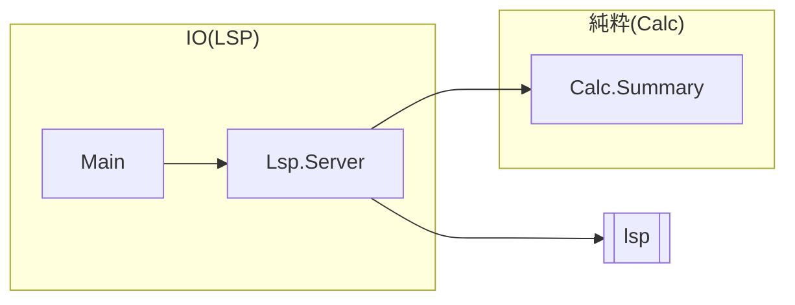

# C4: Component

サーバのモジュールと，importの向きを表す．
`Lsp.Server`がLSPのメッセージを受け取り，文書の中身についての計算は純粋な`Calc.Summary`に任せる．

```mermaid
flowchart LR
  subgraph io["IO(LSP)"]
    Main["Main"]
    Lsp_Server["Lsp.Server"]
  end
  subgraph pure["純粋(Calc)"]
    Calc_Summary["Calc.Summary"]
  end
  ext_lsp[["lsp"]]
  Main --> Lsp_Server
  Lsp_Server --> Calc_Summary
  Lsp_Server --> ext_lsp
```

- `Main`は`Lsp.Server.run`を呼ぶだけである．
- `Calc.*`は`lsp`に依存しない．
