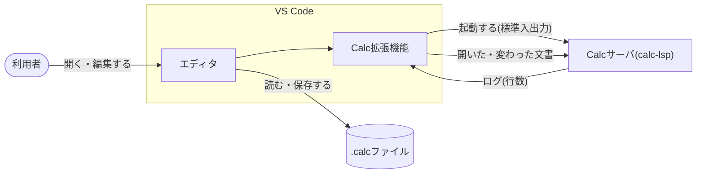

# C4: Context と Container

利用者はVS Codeで`.calc`ファイルを編集する．
Calc拡張機能がCalcサーバ(`calc-lsp`)を起動し，VS CodeとサーバはLSPで文書の内容とログをやり取りする．

```mermaid
flowchart LR
  user(["利用者"])
  subgraph editor["VS Code"]
    vscode["エディタ"]
    client["Calc拡張機能"]
  end
  server["Calcサーバ(calc-lsp)"]
  file[(".calcファイル")]
  user -->|"開く・編集する"| vscode
  vscode -->|"読む・保存する"| file
  vscode --> client
  client -->|"起動する(標準入出力)"| server
  client -->|"開いた・変わった文書"| server
  server -->|"ログ(行数)"| client
```

- サーバはファイルを直接読まない．文書の内容は，エディタから届いた通知で知る．
