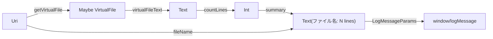

# Code: 型と関数の流れ

文書のURIから，ログに書く文字列を作るまでの流れを表す．

```mermaid
flowchart LR
  Uri -->|"getVirtualFile"| VirtualFile["Maybe VirtualFile"]
  VirtualFile -->|"virtualFileText"| Text
  Text -->|"countLines"| Int
  Int -->|"summary"| Message["Text(ファイル名: N lines)"]
  Uri -->|"fileName"| Message
  Message -->|"LogMessageParams"| LogMessage["window/logMessage"]
```

- `countLines`は，末尾の改行のあとに行を数えない．空の文書は0行である．
- `fileName`は，URIの最後の`/`より後ろである．
- VFSに文書がない場合は，何もしない．
