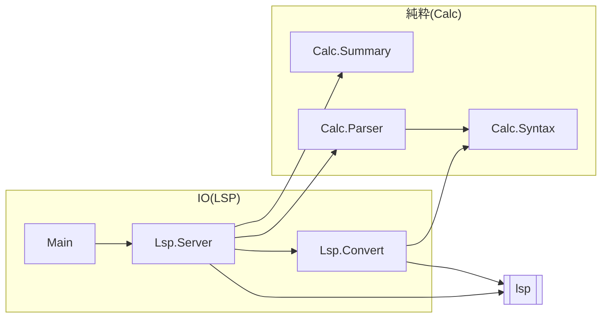

# C4: Component

サーバのモジュールと，importの向きを表す．
`Lsp.Server`がLSPのメッセージを受け取り，文書の解析は純粋な`Calc.*`に任せる．
`Lsp.Convert`が，`Calc.*`の値をLSPの型に変える．

- `Calc.*`は`lsp`に依存しない．LSPの型(`Range`，`Diagnostic`)への変換は`Lsp.Convert`だけが行う．
- `Lsp.Convert`は純粋な関数だけを持つが，LSPの型を扱うので`Lsp.*`の側に置く．
