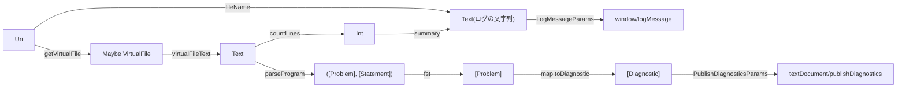

# Code: 型と関数の流れ

文書のURIから，エディタへ送るログと診断を作るまでの流れを表す．

- `parseProgram`は`T.lines`で行に分け，行番号を付けて`parseLine`に渡す．空行とコメント行は`Nothing`になり，残りを`partitionEithers`で問題と文に分ける．
- `parseLine`は，`T.words`で分けた語が`let`，名前，`=`，1語以上の順に並ぶ行を文とする．名前は英字で始まり，英数字が続く．
- 文の`Span`は名前の位置，問題の`Span`は行全体である．列は0から数え，終わりの列は含まない．
- `toRange`は`Span`を同じ行の`Range`に変える．`toDiagnostic`は重さを`Error`，出どころを`calc`にする．
- 診断には，文書の版(`virtualFileVersion`)を添える．
