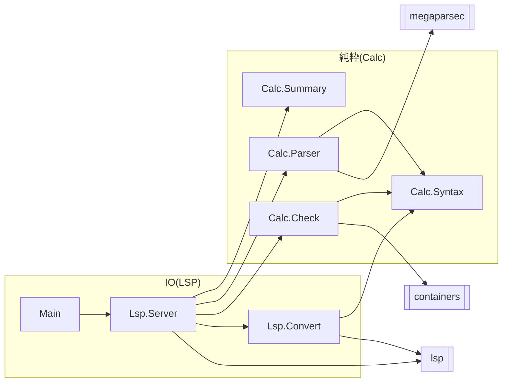

# C4: Component

サーバのモジュールと，importの向きを表す．
`Lsp.Server`がLSPのメッセージを受け取り，文書の解析と名前の検査は純粋な`Calc.*`に任せる．
`Lsp.Convert`が，`Calc.*`の値をLSPの型に変える．

- `Calc.*`は`lsp`に依存しない．LSPの型(`Range`，`Diagnostic`)への変換は`Lsp.Convert`だけが行う．
- `Calc.Parser`は1行ずつ読み，`Calc.Check`は読めた文の一覧から名前を調べる．`Calc.Check`は`Calc.Parser`を使わない．
