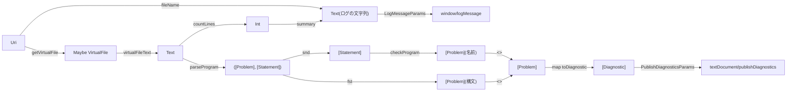

# Code: 型と関数の流れ

文書のURIから，エディタへ送るログと診断を作るまでの流れを表す．

- `parseLine`は，まず`let <name> =`の部分(`header`)を読む．読めなければ，行全体に`expected: let <name> = <expr>`を付ける．読めれば，行全体を文(`statement`)として読み，読めなかった位置から行末までにmegaparsecのメッセージを付ける．
- 式は`chainLeft`で読む．`+` `-`は`*` `/`より弱く結合し，同じ強さの演算子は左から結合する．`--`から行末まではコメントとして読み飛ばす．
- `Var`は，変数を使った位置の`Span`を持つ．
- `checkProgram`は，`mapAccumL`で定義済みの名前の`Set`を上の行から持ち回る．各文で，式の`variables`のうち未定義のものと，名前の二重定義を問題にする．
- 診断は，構文の問題，名前の問題の順に並べる．
