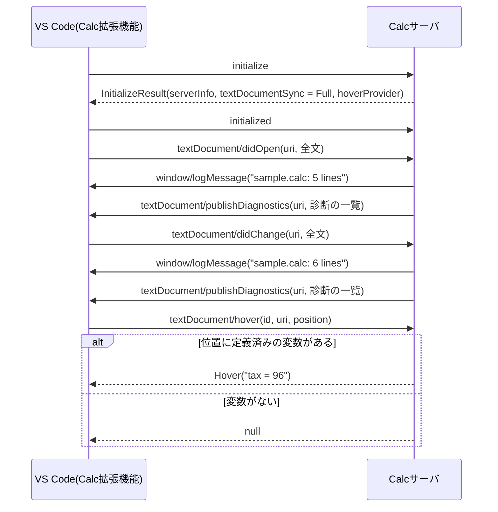

# LSPのメッセージの順序

エディタがサーバを起動してから，文書を開いて編集し，変数にカーソルを重ねるまでのメッセージを表す．

- `initialize`と`textDocument/hover`はリクエストで，同じ`id`の応答がある．ほかは通知で，応答はない．
- `publishDiagnostics`は，その文書の診断をすべて送り直す．エディタは前の診断を新しい一覧で置き換える．
