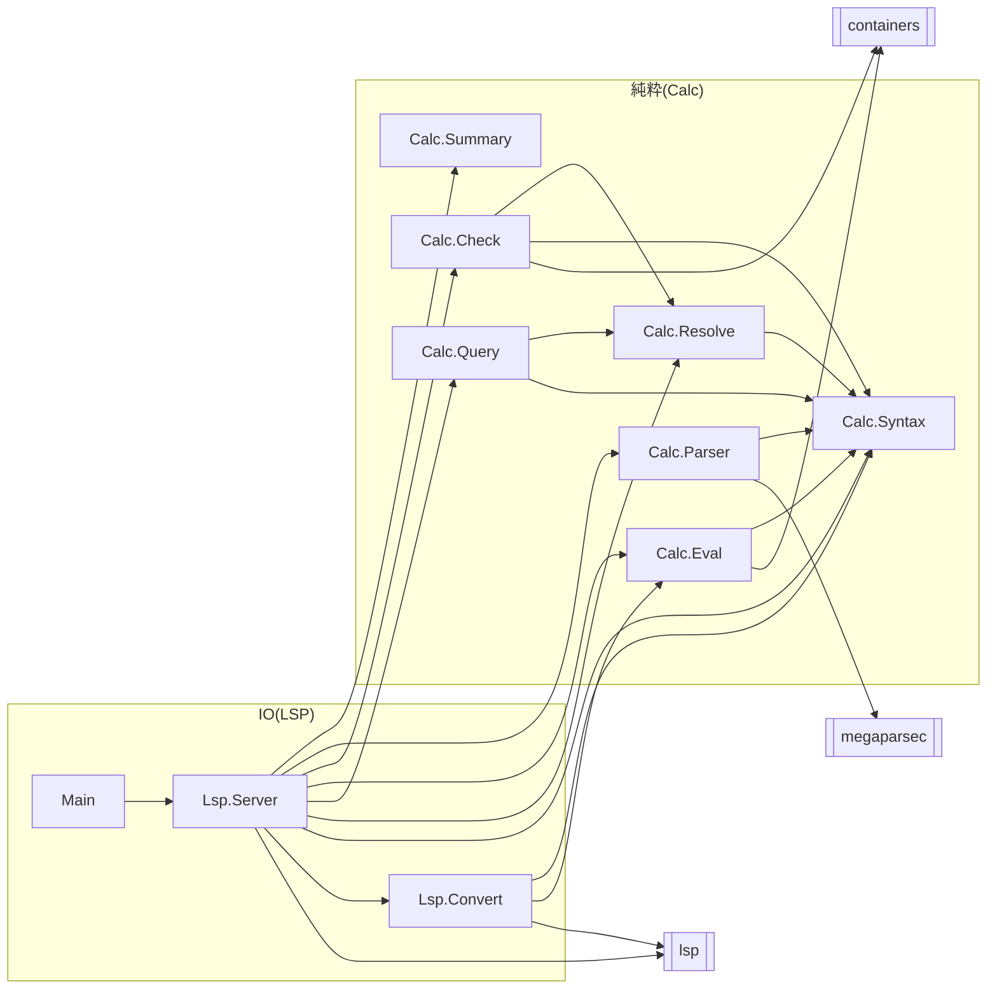

# C4: Component

サーバのモジュールと，importの向きを表す．
`Lsp.Server`がLSPのメッセージを受け取り，文書の解析，名前の検査，評価，位置の検索は純粋な`Calc.*`に任せる．
名前の定義と使用の一覧は`Calc.Resolve`が一度作り，`Calc.Check`と`Calc.Query`が使う．

- `Calc.*`は`lsp`に依存しない．LSPの型への変換は`Lsp.Convert`だけが行う．
- 式の木をたどって名前を集めるのは`Calc.Resolve`(`occurrences`)と`Calc.Eval`だけである．`Calc.Check`と`Calc.Query`は`[Occurrence]`を使う．
