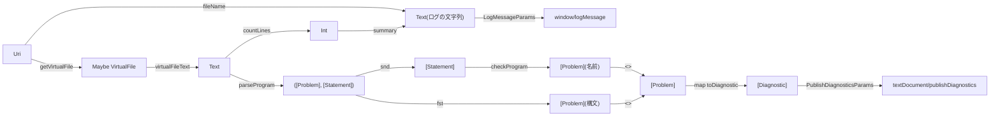
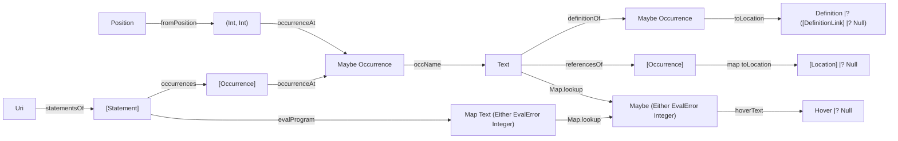
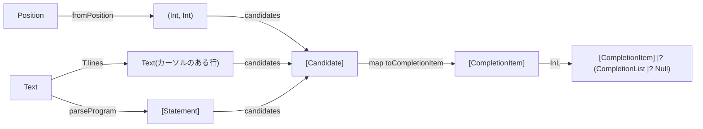

# Code: 型と関数の流れ

文書から作る値と，それを使う機能の流れを表す．
1つ目の図は文書の検査(ログと診断)，2つ目の図は位置を受け取るリクエスト(ホバー，定義，参照)，3つ目の図は補完である．

- `parseLine`は，まず`let <name> =`の部分(`header`)を読む．読めなければ，行全体に`expected: let <name> = <expr>`を付ける．読めれば，行全体を文(`statement`)として読み，読めなかった位置から行末までにmegaparsecのメッセージを付ける．
- 式は`chainLeft`で読む．`+` `-`は`*` `/`より弱く結合し，同じ強さの演算子は左から結合する．`--`から行末まではコメントとして読み飛ばす．
- `checkProgram`は，`occurrences`の結果を`mapAccumL`でたどり，定義済みの名前の`Set`を持ち回る．`Use`が集合になければ未定義，`Definition`がすでに集合にあれば二重定義である．
- 診断は，構文の問題，名前の問題の順に並べる．

- `occurrences`は，評価の順に並ぶ．各文で，式の変数(左から)，名前の定義の順である．
- `occurrenceAt`は，位置を含む最初の出現を返す．`Span`の終わりの列は含まない．
- `definitionOf`は，その名前の最初の`Definition`を返す．
- `referencesOf`は，名前が定義されていなければ空である．定義されていれば，`Use`と，求められたときは`Definition`を，出現の順に返す．
- `evalProgram`は上の文から順に評価する．値は`Either`の`do`で計算し，0での割り算と未定義の変数を`Left`で伝える．同じ名前の2回目の定義は評価しない．`/`は`div`である．
- 結果がないとき，ホバーは`Null`，定義は`InR (InR Null)`，参照は空の一覧を返す．

- `candidates`は，カーソルの前の文字列から，入力中の語(名前の文字が続く部分)と，その前の部分を取り出す．
- 前の部分が空白だけなら`let`を，`=`を含むなら上の行で定義された変数を候補にする．それ以外(定義の名前を入力中)は候補なしである．
- 変数の候補は，カーソルの行より上の文だけを`evalProgram`で評価し，最初の定義の順に並べる．
- 候補は，入力中の語で始まるものだけを残す．
- `toCompletionItem`は，変数の候補の`detail`にホバーと同じ文字列(`hoverText`)を入れる．
