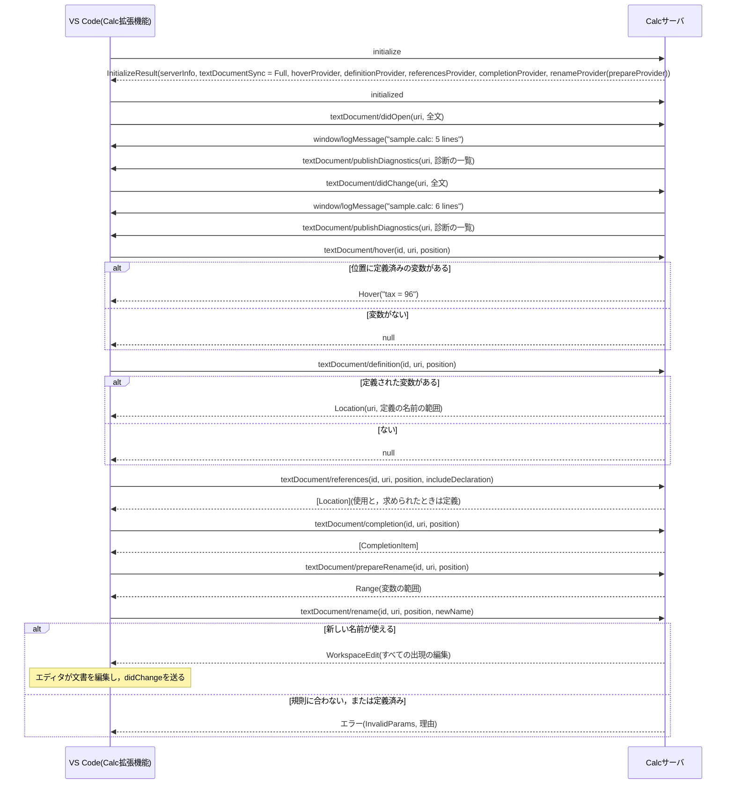

# LSPのメッセージの順序

エディタがサーバを起動してから，文書を開いて編集し，変数のホバー，定義，参照，補完，リネームを求めるまでのメッセージを表す．

- `initialize`と，`textDocument/`で始まるメソッドのうち`didOpen`，`didChange`，`publishDiagnostics`以外はリクエストで，同じ`id`の応答がある．
- `initialized`，`didOpen`，`didChange`，`window/logMessage`，`publishDiagnostics`は通知で，応答はない．
- `publishDiagnostics`は，その文書の診断をすべて送り直す．エディタは前の診断を新しい一覧で置き換える．
