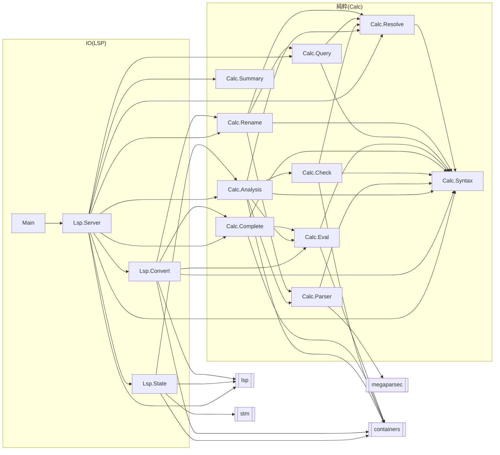

# C4: Component

サーバのモジュールと，importの向きを表す．
`Lsp.Server`がLSPのメッセージを受け取る．
文書が開かれたときと変わったときに，`Calc.Analysis`が文書を1回だけ解析し，`Lsp.State`のキャッシュに入れる．
リクエストのハンドラは，キャッシュの解析結果を純粋な`Calc.*`の関数で検索する．

- `Calc.*`は`lsp`に依存しない．LSPの型への変換は`Lsp.Convert`だけが行う．
- 解析(`parseProgram`，`checkProgram`，`occurrences`，`evalProgram`)を呼ぶのは`Calc.Analysis`だけである．`Lsp.Server`は解析結果(`Analysis`)を受け取って使う．
- 共有する状態(キャッシュ)を持つのは`Lsp.State`だけである．
- `Calc.Rename`は，名前の規則を`Calc.Parser`の`isValidName`で確かめる．
- `Calc.Complete`は，解析できた文に加えて，カーソルのある行の文字列を受け取る．書きかけで解析できない行でも候補を出すためである．
