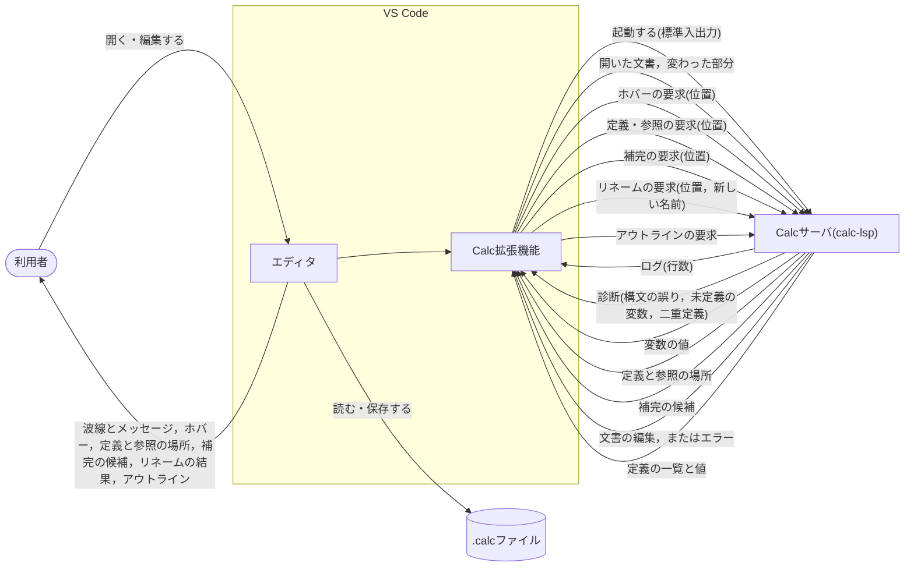

# C4: Context と Container

利用者はVS Codeで`.calc`ファイルを編集する．
Calc拡張機能がCalcサーバ(`calc-lsp`)を起動し，VS CodeとサーバはLSPで文書の内容，ログ，診断をやり取りする．

- サーバはファイルを直接読まない．文書の内容は，エディタから届いた通知で知る．
- サーバはファイルを直接書き換えない．リネームでは編集を返し，エディタが文書に適用する．
- 診断は文書ごとに，そのときの問題をすべて送る．問題がなければ空の一覧を送り，前の波線を消す．
