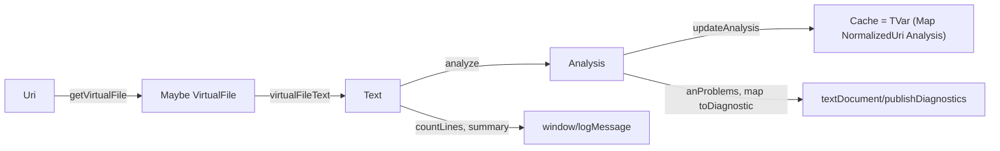
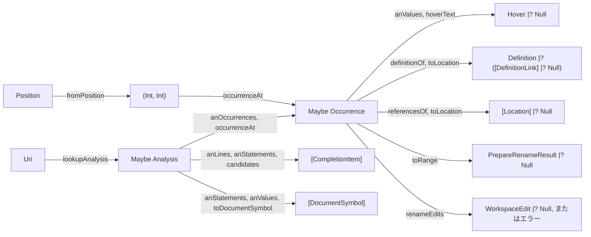

# Code: 型と関数の流れ

文書から解析結果を作ってキャッシュに入れる流れと，キャッシュの解析結果から各リクエストの結果を作る流れを表す．

- `analyze`は，`parseProgram`，`checkProgram`，`occurrences`，`evalProgram`を1回ずつ呼び，結果を`Analysis`にまとめる．
- `anProblems`は，構文の問題，名前の問題の順である．
- `updateAnalysis`は，`atomically`の中で`modifyTVar'`を使い，文書のURIの解析結果を置き換える．
- 差分同期では，`didChange`は変わった部分だけを運ぶ．`lsp`ライブラリがVFSの文書に差分を適用してからハンドラを呼ぶので，`virtualFileText`は常に文書全体である．

- 解析結果がない(開かれていない)文書では，どのリクエストも結果なしを返す．
- `occurrenceAt`は，位置を含む最初の出現を返す．`Span`の終わりの列は含まない．出現は評価の順(各文の式の使用，名前の定義)に並ぶ．
- `definitionOf`は最初の定義を返す．`referencesOf`は，名前が定義されていなければ空である．
- `renameEdits`は，新しい名前が規則に合わないか`let`なら`InvalidName`，すでに定義されていれば`AlreadyDefined`を返す．失敗は`TResponseError`(`InvalidParams`)になる．
- `candidates`は，カーソルの行の文字列から入力中の語を取り出す．行頭なら`let`，右辺なら上の行で定義された変数を，入力中の語で絞って返す．
- アウトラインは，文の順に名前と値(`valueText`)を並べる．同じ名前の2回目の定義には，最初の定義の値が付く．
