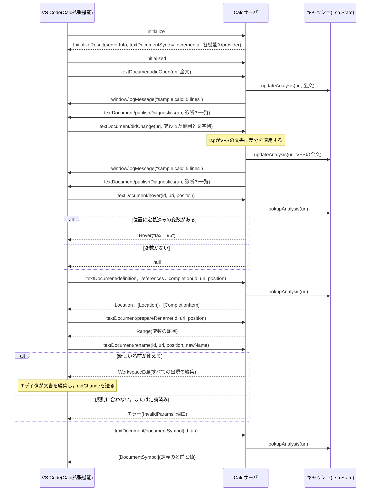

# LSPのメッセージの順序

エディタがサーバを起動してから，文書を開いて編集し，各機能を求めるまでのメッセージと，サーバのキャッシュとのやり取りを表す．

- `initialize`と，`textDocument/`で始まるメソッドのうち`didOpen`，`didChange`，`publishDiagnostics`以外はリクエストで，同じ`id`の応答がある．`Cache`への矢印は，サーバの中の関数呼び出しである．
- `initialized`，`didOpen`，`didChange`，`window/logMessage`，`publishDiagnostics`は通知で，応答はない．
- `publishDiagnostics`は，その文書の診断をすべて送り直す．エディタは前の診断を新しい一覧で置き換える．
- 文書の解析は`didOpen`と`didChange`のときだけ行う．リクエストはキャッシュの解析結果を読むだけである．
- `textDocumentSync = Incremental`なので，`didChange`は変わった部分だけを運ぶ．
